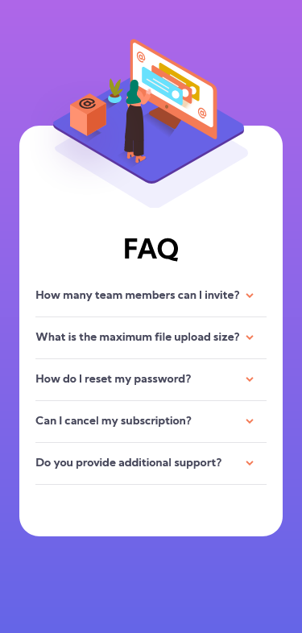
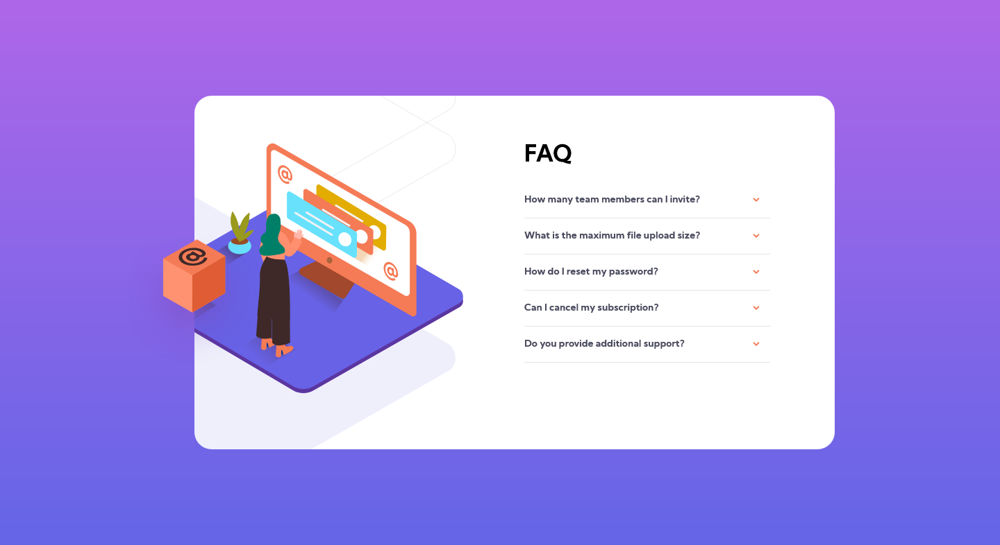

# FAQ card

This is a solution to the [FAQ card challenge on Frontend Mentor](https://www.frontendmentor.io/challenges/faq-accordion-card-XlyjD0Oam). Frontend Mentor challenges help you improve your coding skills by building realistic projects.

## Table of contents

- [Overview](#overview)
  - [The challenge](#the-challenge)
  - [Screenshot](#screenshot)
  - [Links](#links)
- [My process](#my-process)
  - [Built with](#built-with)
  - [Useful resources](#useful-resources)
- [Author](#author)

## Overview

### The challenge

Users should be able to:

- View the optimal layout for the component depending on their device's screen size
- See hover states for all interactive elements on the page
- Hide/Show the answer to a question when the question is clicked

### Screenshot

### Links

- Solution URL: [https://github.com/omarlawaty/faq-card](https://github.com/omarlawaty/faq-card)
- Live Site URL: [https://faq-card-git-main-omarmo.vercel.app/](https://faq-card-git-main-omarmo.vercel.app/)

## My process

### Built with

- Semantic HTML5 markup
- CSS custom properties
- Flexbox

### Useful resources

- [Stack Overflow](https://stackoverflow.com/)
- [W3Schools](https://www.w3schools.com/)

## Author

- Name - Omar Mohamed
- Frontend Mentor - [@OmarMo123](https://www.frontendmentor.io/profile/OmarMo123)
- Twitter - [@OmarMo77563488](https://www.twitter.com/OmarMo77563488)
